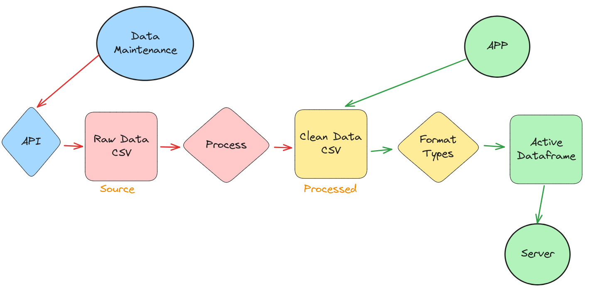

### Welcome to the repo for 
# The Center for Llamas who want to Curve good
## *and do governance stuff good too*

___

# To run
In the root directory enter the following in your terminal.
```bash
python wsgi.py
```
Advise making a virtual env to run it within to contain dependencies, though I tried to be minimal.
___
# Overview
Curve has a complex governance ecosystem. 

CRV holders lock in the locker to vote on Gauge Votes on chain (among other things).

Some CRV is locked in a wrapper contract such as Convex's cvxCRV and delegates its votes to vlCVX votes via snapshot. 

This dashboard hopes to clearly present the activity of Curve Governance and expand into its various wrapped markets to complete the picture. 


___
# Architecture
Flask based website powered by Pandas Dataframes following a Model View Controler structure. 

## Fetch
Each folder has a `fetch.py` which holds the query and a fetch function which queries and saves data. This can be toggled so you can reprocess without requerying

## Process
Each folder has a `process_flipside.py` which holds the code which enriches the data and generates relationships to checkpoints, gauges, DAO addresses, etc. 

## Model
Each folder has `models.py` which reads data from a CSV and forms dataframes of data.
This step also formats the data into the right types.

**there is no database at present and csv fed dataframes seems to be plenty effective for the time being**

> The above three are currently integrated into `app/data/data_manager.py` for easier operations

## View
Each folder has a `/templates` folder which contains jinja2 template files which are hybrid html/python files. 
These define how to display information.
For now rely on gridjs for tables, plotly for charts, ands bootstrap for css.

## Controller
Each folder has `routes.py` which defines individual pages and any data handling between data source and the display. 
Here we define what info populates charts, tables, etc

The core application is defined in `__init__.py` in the `/app` folder
To enable a route in the site, the *bp* type value known as the blueprint needs to be imported from `routes.py` into `__init__.py`.

## Data
At present data is simply CSV's.

There is a jupyter notebook `data_tool_v2.ipynb` which taps into `app/data/data_manager.py` to update raw data, and process it to what the site relies upon. 

To apply changes restart the server to precompile new dataframes. 

### app.config
A lot of data references each other. Rather than having each server refresh rebuild each model multiple times every time its referenced, models are stored in the `app.config`. 

**However this can only work in the application context.**

In order for the models to work locally in jupyter notebooks we import dataframes under a try/except statement, first through the `app.config` and if that fails (it's running locally), import directly which will take more time as each model builds its own dependencies. 

```python
try:
    dataframe_model = app.config['dataframe_model']
except: 
    from app.protocol.component.models import dataframe_model
```
Likewise for storing data into the `app.config` wrap that in a try/except, and use a print statement to ensure we can tell that's not storing properly in web context.
```python
try
    app.config['dataframe_model'] = dataframe_model
except:
    print(f"could not register in app.config\n\t{component}")
```
___
## General Dev Flow
1. create component folder
2. create `fetch.py` for querying data and saving in 'app/data/raw_data/'
3. create `process_flipside.py` for processing data and saving in 'app/data/processed/'
4. create `models.py` for formating types and reading processed data, generating a few views
5. create `routes.py` for composing web pages
    * assemble out the info for each view
7. create `templates` 
8. create a jinja2 template for each view.
9. update `__init__.py` 
    * to import blueprint from `routes.py`
    * to register the new blueprint  
10. update `data_manager.py` to include component
    * to import and execute `fetch` from `fetch.py`
    * to import and execute `process_and_save` from local `process_flipside.py`


___
## Pulling data

1. Update api keys in `config.py` in root folder (containing `app/` folder)
2. Run `data_manager.py`
    * Settings are available in the file
    * `load_initial` should be set as true if first time pulling data
    * `should_fetch` should be set as true if you want to pull new data
        * else will only process existing data
        * `load_initial` will only work if `should_fetch` is set to true
    * `manager_config` is a dict with keys representing each component set to a bool
        * if `True`, will fetch and process according the above parameters

This approach allows more nuanced control over what data is imported if so desired.
* Direct results from API queries are stored in `app/data/raw_data/`
* Processed results are what gets used on the site, and is a secondary process which enriches and merges the initial queried data.

Everything is a dataframe so can open a jupyter notebook and import any data used in the site by importing its dtaframe and directly interacting with it.

ex: 
```python
from app.curve.gauge_checkpoints.models import df_checkpoints_agg
from app.curve.liquidity.models import df_curve_liquidity_aggregates, df_curve_liquidity
from app.convex.snapshot.models import df_convex_snapshot_vote_aggregates
```
___
# Reference Links
* Currently using Boostrap Themes. 
    * Current theme: https://bootswatch.com/minty/

* Tables are reliant on a Javascript library Grid.js
    * Eventually should make server side sorting
    * https://gridjs.io/docs/examples/server-side-sort

* Charts are reliant on Flask-Plotly
    * https://github.com/alanjones2/Flask-Plotly
        * example
        * https://github.com/alanjones2/Flask-Plotly/blob/main/plotly/app2.py

* URL structure is managed by Flask Blueprints
    * https://flask.palletsprojects.com/en/1.1.x/blueprints/
___
# To Do

## General
### Core Mappings
* [] Struggle to connect all gauges to their pools. 
    * Currently pulling from deployer contracts but need better way to identify all deployer contracts
    * [] Connect pool assets to Gauge for filtering
    * [] Connect lost Snapshot data which exists but cannot map from pool to gauge since no pool address linked
* [] Need to add ability to recognize if snapshot votes exist for a given pool to disable navigation if there is no option.
    * [] likewise liquidity where pool exists but flipside hasn't indexed it yet.

## Data Structuring 
### Storage
* ~~At present Data is read from raw queries and proccessed each time the server starts up.~~ 
    * Long downtimes cause this to sometimes be the expirience of page visitors.
    * We can separate events such that we only need to wait for preprocessing when loading new data, but not when updating files.

* Separate Model logic to have an interim post processed Clean Data that can greatly reduce loading speed.
    * [X] Curve Tables (vast majority of processing time)
    * [X] Snapshot Tables
    * [X] Convex Lock
    * [X] StakeDAO Lock/Stake
    * [X] Votium Tables

    * [] Set up a default cutoff how many rounds back to go that can be overwritten.
        * Particularly for large Tables this should help cut down loading time.
        * Ability to overwrite ensures that data is still visible by the UI, but need to standardize. 

### Curve Gauge Checkpoints

* Currently only shows last closed round and compares to prior closed round. 
    * [] Create current round page
    * [] Create vote volume graph of vote change velocity each round
    * Currently no handling of 50% type gauges.
        * [] Determine best way to present this info and its impact on the inflation recieved by other gauges.
            > (Research completed, should implement soon.) 


## Views
### Establish first Experiments Component
* Locally select many filters to compare data. 
    * [] launch experimental pages which allow these sorts of filtered comparisons to be viewed. 
    * Acceptable to be pretty specific
        * [x] Compare Top Vote Changes
            * [X] Update Navigation
        * [x] Targetted Vote / Liquidity Comparissons
            * [] Add to Navigation
* [] harden standardized components for easier plug and play. 


### Add Description of metholodgy to each page
* [] Pages w/ direct queries
* [] Pages assembled from other pages queries

### Processing liquidity
* Takes like 10 minutes where significant time is taken to filter out shitcoins.
    * [X] Revise process for less heavy burden on filtering.
    * [X] Need to solve hacked assets which have no balance changes but price prior to hack since no trades/moves after drained.
* [] Address stETH rebase (and other rebasing coins)
    * This is gonna be hard for pre -cutoff pools. Might just need to go all the way back to curve start
        [] Assess how much more expensive it is to go back further
            - this shouldn't impact staying up to date once initially loaded.
* [] Address WETH Mint/Burn as currently double counts ETH/WETH when the pool handles that mint/burn
* [] Have view which split up basepool assets
    > (have data just need to present it)

### Reorganize
* New Categorization
    * [] History
        * Current views of historic data
        * Apply pivot (view as current or by voter/round)
    * [| Current Events
        * Current weeks battle
    * [] Science
        * Current and new experiments
    > For now taken intermediate steps to make navigation more intuitive. 
    > Need more search features

## New Views
* Convex
    * [X] Locked
    * [] Delegate Snapshot
* StakeDAO
    * [X] staked sdCRV
    * [X] Locked (veSDT)
        * [] Delegated Locked (veSDT) 
    * [] Delegate Snapshot
* Votium v2
    * Votium recently updated to a V2 contract which conviently has the gauge address directly stored. 
    * [] update votium to handle the new contract while supporting old contract data
        * [] once complete, add Votium to core gauge navigation widget  

## Delegation Second Order Impact
* [] Update known as to pull from delegations
    * [?] May require changes to displaying known as for delegates of multiple known addresses such as Votium.
    * May need to move to a relational db for this
* [] Voter Page needs to be able to view as core voter and delegate applied to voting power
    
## Meta Governance Ranking
* [] Merge governance power between entities to rank combined influence
    * harder than it sounds

## Warden 
* veSDT Boost Delegation
    * [X] fetch
    * [] process
    * [] model
    * [] route

* veSDT Vote Bounty Market
    * [X] fetch
    * [] process
    * [] model
    * [] route

    
# Investigate Oddities:
## Mystery misatribution
* BETH Frax mismatch?
    * 0x50161102a240b1456d770dbb55c76d8dc2d160aa: 'ETHwBETHCRV-gauge'
        * Pool: 0xbfab6fa95e0091ed66058ad493189d2cb29385e6
            * But can't link pool.
            

    * 0x2932a86df44fe8d2a706d8e9c5d51c24883423f5: 'FrxETH'
        * Pool: 0xa1f8a6807c402e4a15ef4eba36528a3fed24e577
        * But thinks pool is 
            * 0xbfab6fa95e0091ed66058ad493189d2cb29385e6: ETHwBETHCRV-gauge'

## Delegations As Aggregates
* /convex/delegations/delegator/0x0d5dc686d0a2abbfdafdfb4d0533e886517d4e83
    * Snapshot vote does not match delegation.
* /stakedao/delegations/delegator/0x34a0da8d21af0f6caeec2c25ad07c88cfe483b54
    * Can't find info, not present on delegate page, is found on index.